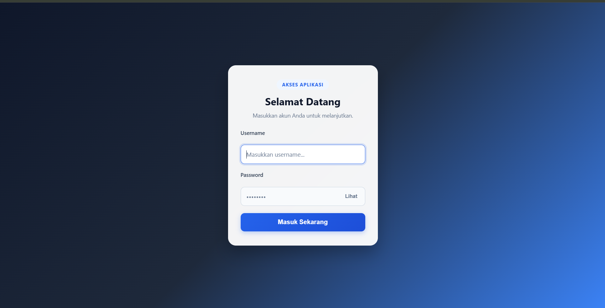
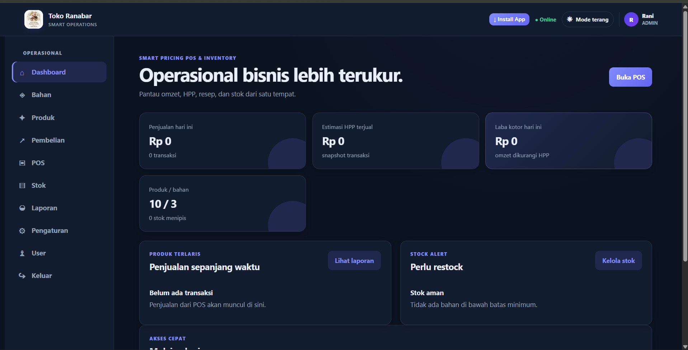
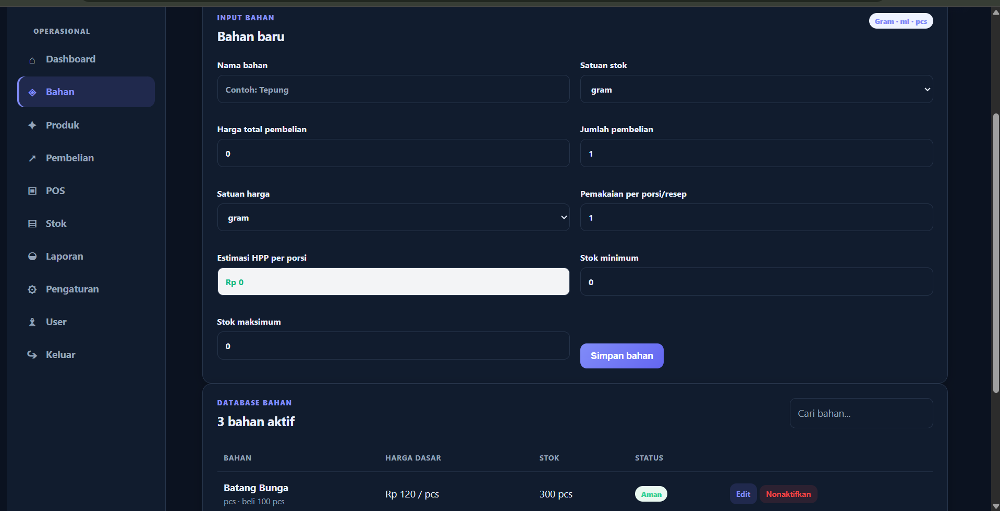
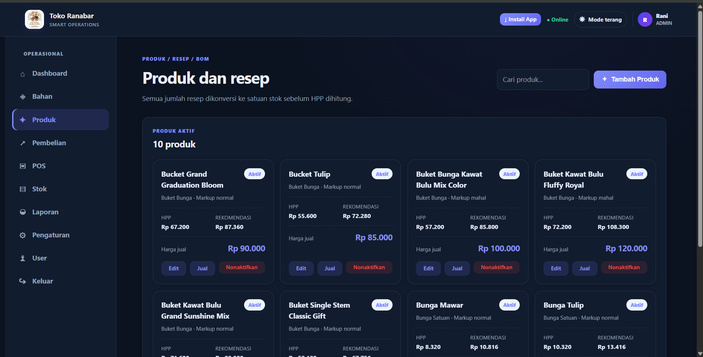
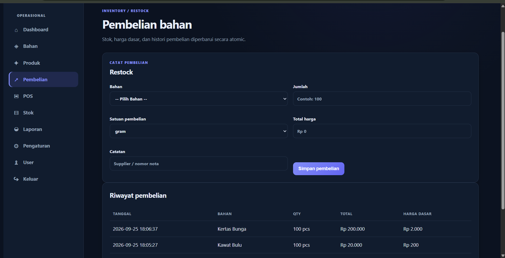
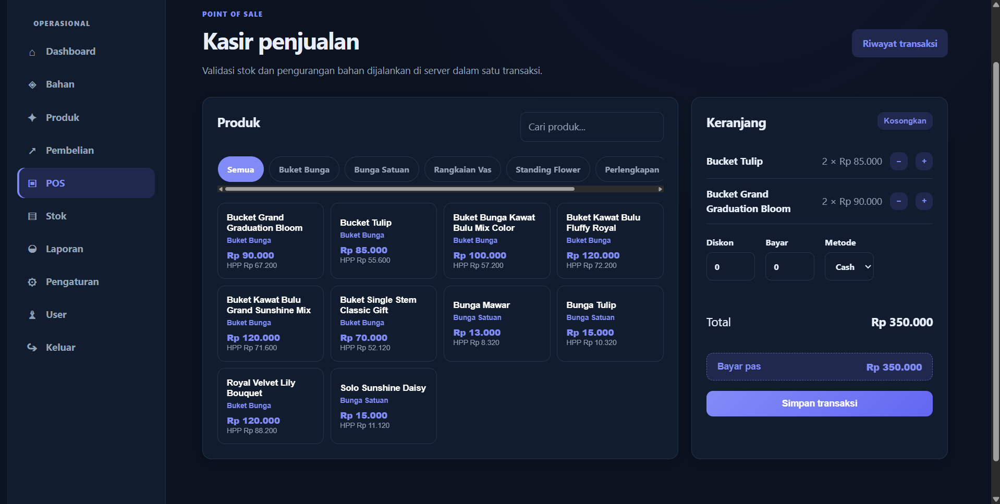
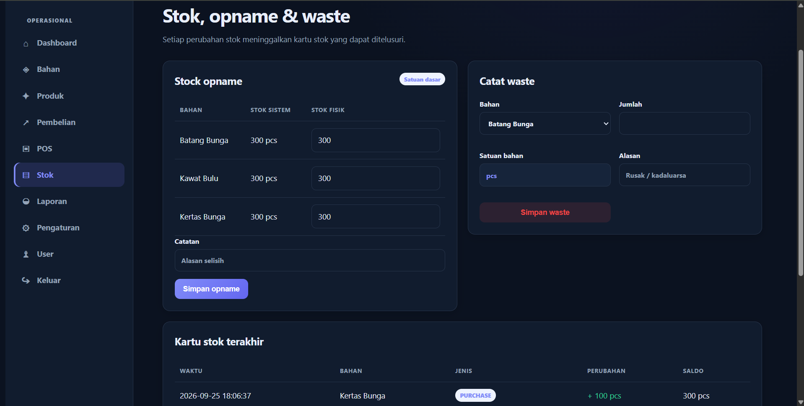
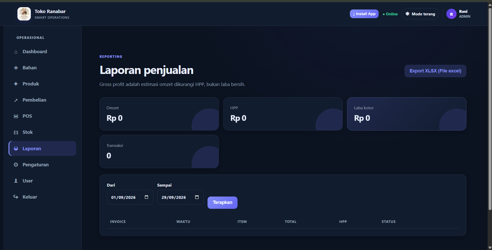
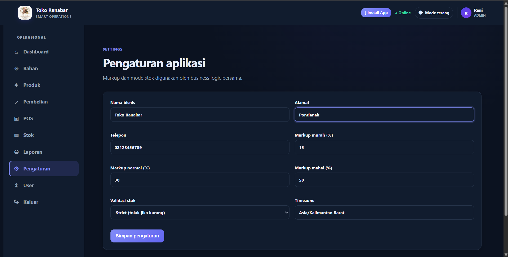
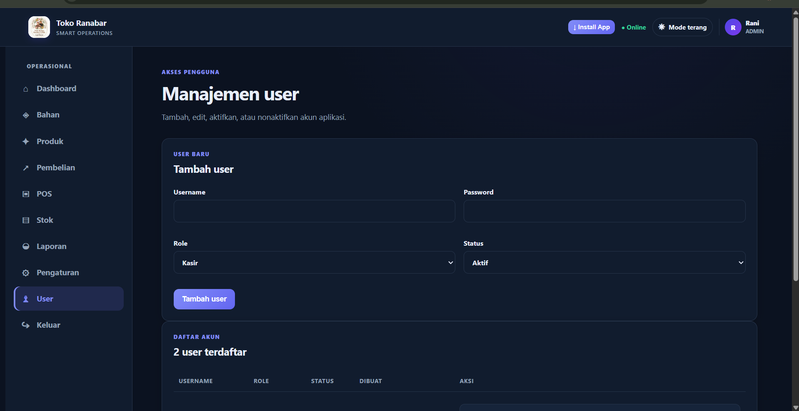

# 🛒 POS & Inventory System for UMKM (Visual Showcase)

> **Notice:** Repositori ini difungsikan khusus sebagai **visual showcase / portofolio tampilan antarmuka (UI)** dari sistem Point of Sale (POS) dan Inventarisasi UMKM yang telah selesai dikembangkan. Repositori ini tidak menyediakan *source code* secara publik.

---

## 📌 About The Project

Aplikasi Web **POS & Inventory System** ini dirancang untuk membantu operasional Usaha Mikro, Kecil, dan Menengah (UMKM) dalam mengelola transaksi penjualan, perhitungan HPP (Harga Pokok Penjualan) secara presisi, pencatatan resep/bahan baku, serta manajemen stok barang secara real-time.

### Key Features
- 🔐 **Autentikasi & Keamanan:** Halaman *login* aman untuk memvalidasi hak akses pengguna.
- 📊 **Dashboard Analitik:** Ringkasan performa penjualan dan statistik utama secara *real-time*.
- 🧪 **HPP & Resep Otomatis:** Perhitungan HPP berbasis komponen bahan dasar (*ingredients*).
- 🛍️ **POS Atomic Interface:** Modul kasir cepat yang terintegrasi langsung dengan pemotongan stok bahan.
- 📦 **Manajemen Stok Kompleks:** Pencatatan stok opname, *waste/shrinkage*, dan kartu stok terperinci.
- 📈 **Laporan Penjualan:** Analisis transaksi penjualan lengkap dengan fitur ekspor data ke format CSV.
- ⚙️ **Pengaturan Bisnis:** Penyesuaian persentase *markup* dan mode kontrol stok ketat (*strict stock mode*).
- 👥 **Role-Based Access Control:** Fitur manajemen pengguna dengan batasan hak akses khusus (Admin & Staf).

---

## 💻 Tech Stack

- **Language:** PHP
- **Database:** MySQL
- **Frontend:** HTML5, CSS3, JavaScript, Bootstrap
- **Reporting:** CSV Exporter Engine

---

## 🖼️ Application Interface & Modules

Berikut adalah dokumentasi tampilan antarmuka dari setiap modul yang ada pada aplikasi:

### 1. Halaman Login (`login.php`)
Gerbang masuk sistem untuk memverifikasi kredensial pengguna (Admin/Staf) sebelum mengakses fitur aplikasi.

---

### 2. Dashboard (`index.php`)
Menampilkan statistik utama, grafik transaksi harian, dan ringkasan kondisi stok barang.

---

### 3. Bahan dan Harga Dasar (`ingredients.php`)
Modul pengelolaan data mentah/bahan baku beserta harga dasar per satuan untuk acuan perhitungan HPP.

---

### 4. Produk, Resep & HPP (`products.php`)
Pengaturan resep produk, formulasi bahan baku, serta kalkulasi otomatis Harga Pokok Penjualan (HPP) dan margin keuntungan.

---

### 5. Pembelian / Restock (`purchases.php`)
Pencatatan riwayat pembelian bahan baku dari pemasok (supplier) untuk memperbarui jumlah persediaan dan harga modal.

---

### 6. POS Atomic (`pos.php`)
Antarmuka kasir utama untuk memproses transaksi penjualan pengguna secara cepat, fleksibel, dan terhubung ke stok.

---

### 7. Stok, Opname, Waste & Kartu Stok (`inventory.php`)
Pusat kendali inventaris untuk melakukan penyesuaian stok (*stock opname*), pencatatan barang rusak/dibuang (*waste*), serta audit log berupa kartu stok.

---

### 8. Penjualan & Laporan CSV (`reports.php`)
Rekapitulasi riwayat transaksi penjualan beserta fitur unduh laporan dalam format CSV untuk analisis keuangan lebih lanjut.

---

### 9. Pengaturan Markup & Strict Stock (`settings.php`)
Konfigurasi aturan bisnis seperti penetapan *markup* standar produk dan aktivasi mode *strict stock* (mencegah transaksi jika stok kosong).

---

### 10. Manajemen User (`users.php` - Restricted: ADMIN Only)
Modul keamanan dan otorisasi untuk menambah, mengubah, atau menghapus hak akses pengguna sistem (Khusus Admin).

---

## 📬 Source Code Access

*Source code* lengkap untuk aplikasi ini bersifat **Private / Closed-Source**. 

Jika Anda adalah perekrut, calon klien, atau rekan pengembang yang tertarik untuk:
- Melihat demonstrasi / demo live dari aplikasi
- Mengulas atau membeli *source code*
- Menjajaki peluang kerja sama / proyek kustomisasi

Silakan hubungi saya melalui:

- 📧 **Email:** [email-anda@domain.com](mailto:mhsbiakbar@gmail.com)

---

  <i>Developed with ❤️ by MH Akbar</i>

